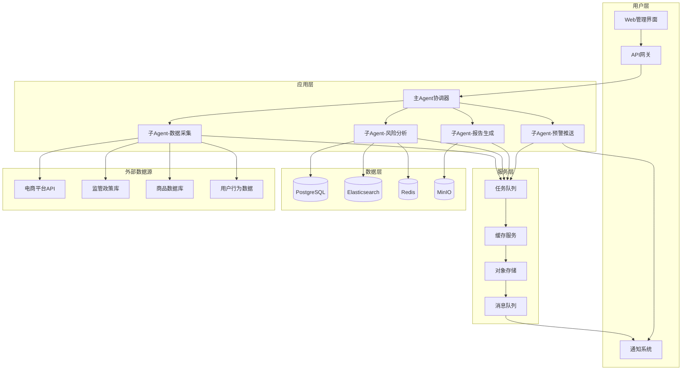
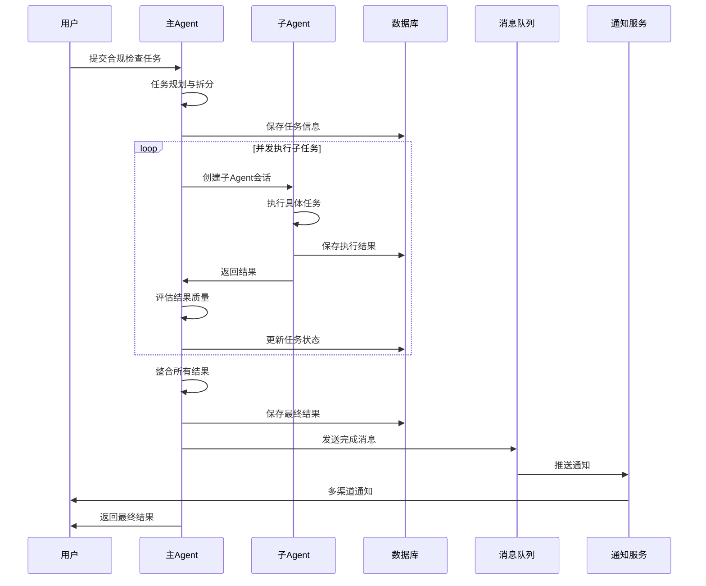
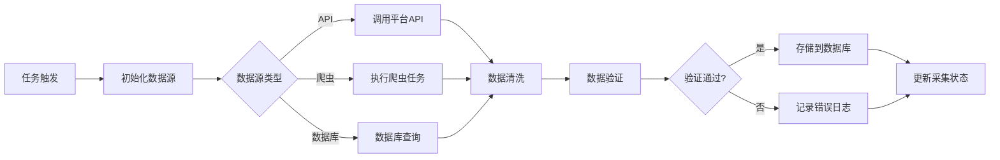
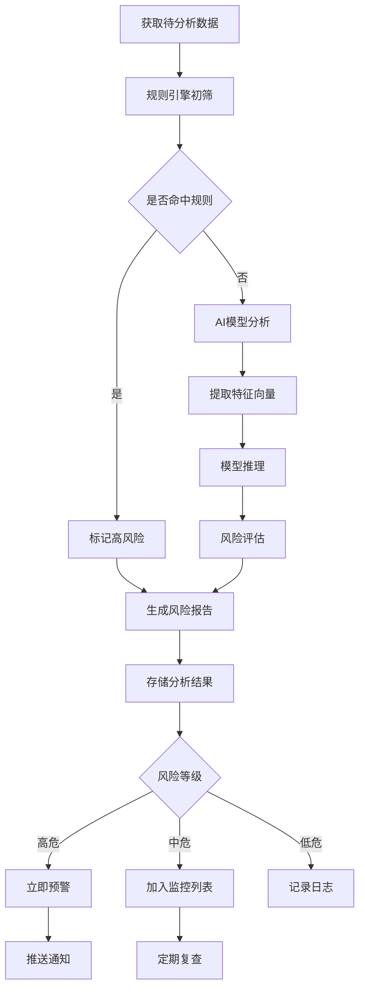
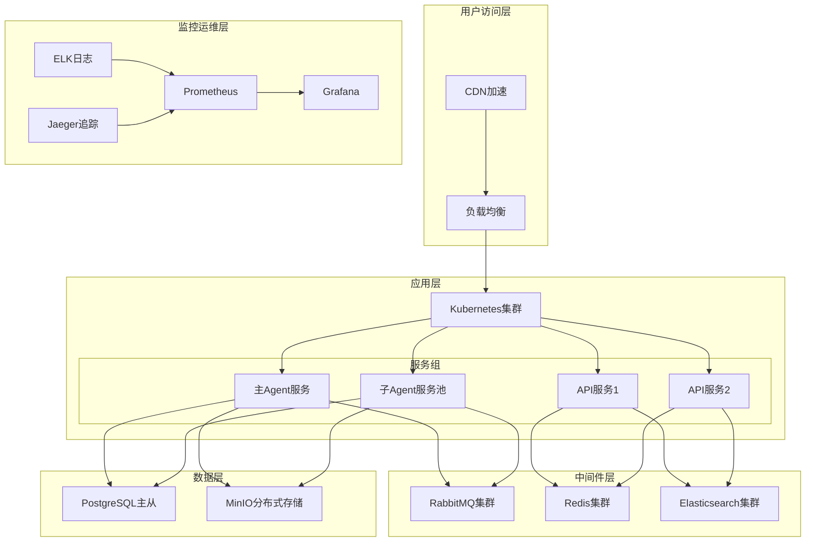

# 电商合规哨兵 - 技术架构设计文档

## 文档信息

- **项目名称**: 电商合规哨兵 (E-commerce Compliance Sentinel)
- **版本**: v1.0
- **编写日期**: 2026-04-17
- **编写人**: OpenClaw Team
- **文档状态**: 初稿

---

## 1. 整体架构设计

### 1.1 架构概述

电商合规哨兵采用**主从Agent分布式架构**，基于OpenClaw框架构建，通过智能化的主从协作机制，实现电商平台的合规风险监控、预警和分析。

### 1.2 架构图



### 1.3 架构说明

#### 三层架构设计

**用户层**: 提供Web管理界面、API网关和通知服务，作为用户与系统的交互入口。

**应用层**: 核心业务逻辑层，采用主从Agent架构：
- **主Agent**: 作为系统协调器，负责任务调度、资源分配、结果整合
- **子Agent**: 独立执行具体任务，包括数据采集、风险分析、报告生成、预警推送

**服务层**: 提供基础服务支持，包括任务队列、缓存、存储和消息队列。

**数据层**: 多数据源架构，包括关系型数据库、搜索引擎、缓存和对象存储。

---

## 2. 技术选型说明

### 2.1 核心框架

| 技术组件 | 选型 | 选择理由 |
|---------|------|---------|
| **AI Agent框架** | OpenClaw | 开源、支持主从架构、工具丰富、社区活跃 |
| **开发语言** | Python 3.10+ | AI生态丰富、开发效率高、与OpenClaw深度集成 |
| **Web框架** | FastAPI | 异步高性能、自动文档生成、类型提示完善 |
| **任务队列** | Celery + Redis | 成熟稳定、支持分布式、监控完善 |

### 2.2 数据存储

| 技术组件 | 选型 | 选择理由 |
|---------|------|---------|
| **关系型数据库** | PostgreSQL 15 | 开源、功能强大、支持JSON、扩展性好 |
| **搜索引擎** | Elasticsearch 8.x | 全文检索、日志分析、聚合查询强 |
| **缓存数据库** | Redis 7.x | 高性能、支持多种数据结构、持久化 |
| **对象存储** | MinIO | S3兼容、私有部署、成本低 |

### 2.3 消息与通知

| 技术组件 | 选型 | 选择理由 |
|---------|------|---------|
| **消息队列** | RabbitMQ | 可靠性高、支持多种协议、管理界面友好 |
| **实时通知** | WebSocket | 双向通信、实时性好、浏览器原生支持 |
| **异步通知** | 飞书/钉钉/企业微信 | 企业级通知、支持机器人、API完善 |

### 2.4 监控与运维

| 技术组件 | 选型 | 选择理由 |
|---------|------|---------|
| **容器编排** | Docker + Kubernetes | 标准化部署、弹性伸缩、生态成熟 |
| **监控告警** | Prometheus + Grafana | 开源、可视化强大、告警规则灵活 |
| **日志收集** | ELK Stack | 统一日志管理、查询方便、扩展性好 |
| **APM监控** | Jaeger | 分布式追踪、性能分析、开源 |

### 2.5 AI模型

| 技术组件 | 选型 | 选择理由 |
|---------|------|---------|
| **主模型** | 智谱GLM-4-Plus | 中文能力强、性价比高、API稳定 |
| **备选模型** | DeepSeek/GPT-4 | 容错、多模型支持 |
| **向量模型** | BGE-M3 | 中文向量、开源、性能优秀 |
| **NLP处理** | HuggingFace Transformers | 生态丰富、模型多样、易集成 |

---

## 3. 系统模块设计

### 3.1 主Agent模块 (Master Agent)

**职责**: 系统总协调器，负责全局任务调度和资源管理

#### 核心功能

1. **任务规划与拆分**
   - 分析用户需求，拆分为可执行的子任务
   - 生成子任务描述和验收标准
   - 建立任务依赖关系图

2. **子Agent生命周期管理**
   - 创建子Agent会话
   - 监控子Agent执行状态
   - 处理超时和异常
   - 销毁完成的子Agent

3. **结果评估与整合**
   - 接收子Agent执行结果
   - 评估结果质量（打分机制）
   - 整合多个子任务结果
   - 生成最终交付物

4. **进度跟踪与报告**
   - 记录任务执行进度
   - 生成进度报告
   - 发送进度通知
   - 更新检查点

#### 设计特点

- **无状态设计**: 主Agent不保留工具状态，避免状态锁死
- **上下文控制**: 保持上下文<1000 token，防止内存爆炸
- **自动恢复**: 支持断点续传，任务中断后自动恢复
- **并行调度**: 同时调度多个独立子任务，提升效率

### 3.2 子Agent模块 (Slave Agent)

**职责**: 独立执行具体任务，用完即毁，无状态残留

#### 子Agent类型

##### 3.2.1 数据采集Agent (Data Collection Agent)

**职责**: 从多源采集电商合规相关数据

**功能模块**:
- **平台数据采集**: 调用电商平台API，采集商品信息、店铺信息、交易数据
- **政策数据采集**: 爬取监管政策、法规更新、行业标准
- **舆情数据采集**: 监控社交媒体、新闻媒体、用户评论
- **结构化处理**: 清洗、去重、标准化数据

**技术实现**:
```python
class DataCollectionAgent:
    def __init__(self, task_config):
        self.config = task_config
        self.sources = []  # 数据源列表
        self.collector = DataCollector()  # 采集器
        
    async def execute(self):
        # 1. 初始化数据源
        sources = self.init_sources()
        
        # 2. 并发采集
        results = await self.collector.parallel_collect(sources)
        
        # 3. 数据清洗
        cleaned_data = self.clean_data(results)
        
        # 4. 存储到数据库
        self.save_to_db(cleaned_data)
        
        return {"status": "success", "count": len(cleaned_data)}
```

##### 3.2.2 风险分析Agent (Risk Analysis Agent)

**职责**: 分析合规风险，识别违规行为

**功能模块**:
- **规则引擎**: 基于政策法规构建规则库
- **AI分析**: 利用大模型分析商品描述、宣传文案
- **风险评估**: 计算风险等级、风险概率
- **案例匹配**: 匹配历史违规案例，提供参考

**技术实现**:
```python
class RiskAnalysisAgent:
    def __init__(self, task_config):
        self.config = task_config
        self.rule_engine = RuleEngine()
        self.ai_analyzer = AIAnalyzer()
        
    async def execute(self):
        # 1. 加载分析数据
        data = self.load_data()
        
        # 2. 规则引擎初筛
        rule_results = self.rule_engine.check(data)
        
        # 3. AI深度分析
        ai_results = await self.ai_analyzer.analyze(data)
        
        # 4. 风险评分
        risk_scores = self.calculate_risk(rule_results, ai_results)
        
        # 5. 生成分析报告
        report = self.generate_report(risk_scores)
        
        return {"status": "success", "report": report}
```

##### 3.2.3 报告生成Agent (Report Generation Agent)

**职责**: 生成合规报告、分析报告、整改建议

**功能模块**:
- **数据聚合**: 从多数据源聚合数据
- **模板渲染**: 基于模板生成标准化报告
- **图表生成**: 可视化数据分析结果
- **导出功能**: 支持PDF、Word、Excel等多种格式

**技术实现**:
```python
class ReportGenerationAgent:
    def __init__(self, task_config):
        self.config = task_config
        self.template_engine = TemplateEngine()
        
    async def execute(self):
        # 1. 聚合数据
        data = self.aggregate_data()
        
        # 2. 选择报告模板
        template = self.select_template(self.config['report_type'])
        
        # 3. 渲染报告
        report = self.template_engine.render(template, data)
        
        # 4. 生成图表
        charts = self.generate_charts(data)
        
        # 5. 导出文件
        file_path = self.export_report(report, charts)
        
        return {"status": "success", "file": file_path}
```

##### 3.2.4 预警推送Agent (Alert Push Agent)

**职责**: 实时监控风险，触发预警通知

**功能模块**:
- **实时监控**: 监控风险指标变化
- **阈值判断**: 根据预设阈值触发预警
- **多渠道推送**: 飞书、钉钉、企业微信、邮件、短信
- **升级机制**: 根据风险等级升级通知

**技术实现**:
```python
class AlertPushAgent:
    def __init__(self, task_config):
        self.config = task_config
        self.notifier = MultiChannelNotifier()
        
    async def execute(self):
        # 1. 监控风险指标
        metrics = self.monitor_metrics()
        
        # 2. 阈值判断
        alerts = self.check_thresholds(metrics)
        
        # 3. 生成预警消息
        messages = self.generate_alerts(alerts)
        
        # 4. 多渠道推送
        results = await self.notifier.send(messages)
        
        # 5. 记录推送日志
        self.log_alerts(alerts, results)
        
        return {"status": "success", "alerts": len(alerts)}
```

### 3.3 数据服务模块

**职责**: 提供统一的数据访问接口

#### 核心服务

1. **数据采集服务**
   - API接口封装
   - 数据源管理
   - 采集任务调度
   - 数据质量校验

2. **数据存储服务**
   - 数据库访问层
   - 缓存访问层
   - 搜索引擎访问层
   - 对象存储访问层

3. **数据同步服务**
   - 数据变更捕获（CDC）
   - 数据同步管道
   - 数据一致性保证

### 3.4 API网关模块

**职责**: 统一入口，路由转发，安全控制

#### 核心功能

1. **路由转发**: 将请求转发到对应的服务
2. **认证授权**: JWT令牌验证、权限检查
3. **限流熔断**: 防止系统过载
4. **日志记录**: 请求日志、访问统计
5. **协议转换**: HTTP/gRPC/WebSocket互转

### 3.5 通知服务模块

**职责**: 多渠道消息推送

#### 支持渠道

- **即时通讯**: 飞书、钉钉、企业微信
- **邮件**: SMTP邮件服务
- **短信**: 阿里云短信、腾讯云短信
- **Web推送**: WebSocket实时推送

---

## 4. 数据流程设计

### 4.1 主流程图



### 4.2 数据采集流程



### 4.3 风险分析流程



### 4.4 数据流转说明

#### 数据流向

1. **输入层**:
   - 用户通过Web界面或API提交任务
   - 外部系统通过Webhook推送数据
   - 定时任务自动触发采集

2. **处理层**:
   - 主Agent接收任务，拆分子任务
   - 子Agent从数据层读取数据
   - 子Agent执行业务逻辑
   - 子Agent将结果写回数据层

3. **存储层**:
   - 原始数据存储到PostgreSQL
   - 分析结果存储到Elasticsearch
   - 临时数据缓存到Redis
   - 文件报告存储到MinIO

4. **输出层**:
   - 结果通过API返回给用户
   - 报告文件通过下载链接提供
   - 预警通过多渠道推送

---

## 5. 部署架构设计

### 5.1 开发环境

```yaml
架构: 单机部署
服务器: 本地开发机
组件:
  - Python 3.10+
  - PostgreSQL 15 (Docker)
  - Redis 7 (Docker)
  - MinIO (Docker)
  
特点:
  - 快速启动，便于调试
  - 使用Docker Compose一键部署依赖
  - 日志输出到控制台
  - 不启用集群和高可用
```

**部署脚本**:
```bash
# 启动依赖服务
docker-compose up -d

# 安装Python依赖
pip install -r requirements.txt

# 初始化数据库
python scripts/init_db.py

# 启动开发服务器
python master_slave_iterate.py --env dev
```

### 5.2 测试环境

```yaml
架构: 小规模集群
服务器: 2台云服务器
配置:
  - 应用服务器: 4核8G
  - 数据库服务器: 4核16G
  
组件:
  - Kubernetes集群 (3节点)
  - PostgreSQL主从
  - Redis哨兵模式
  - Elasticsearch单节点
  - MinIO单节点
  
特点:
  - 模拟生产环境
  - 启用自动化测试
  - 启用性能监控
  - 数据隔离
```

### 5.3 生产环境

```yaml
架构: 高可用集群
服务器: 云原生架构
配置:
  - 应用集群: 8台 8核16G
  - 数据库集群: 3台 8核32G (主从+读写分离)
  - 缓存集群: 3台 4核8G (Redis Cluster)
  - 存储集群: 5台 4核8G (MinIO分布式)
  - 搜索集群: 3台 8核16G (Elasticsearch)
  
组件:
  - Kubernetes集群 (多可用区)
  - 负载均衡: Nginx/HAProxy
  - 服务网格: Istio
  - 监控: Prometheus + Grafana
  - 日志: ELK Stack
  - 追踪: Jaeger
  
特点:
  - 高可用（99.9%）
  - 自动扩缩容
  - 灰度发布
  - 全链路监控
  - 灾备恢复
```

### 5.4 部署架构图



---

## 6. 安全设计

### 6.1 数据安全

#### 数据加密

1. **传输加密**:
   - 全站HTTPS
   - API通信TLS 1.3
   - 数据库连接SSL

2. **存储加密**:
   - 敏感数据AES-256加密
   - 数据库字段级加密
   - API Key加密存储

3. **备份加密**:
   - 备份文件加密
   - 异地加密存储
   - 访问权限控制

#### 数据脱敏

```python
# 敏感数据脱敏规则
SENSITIVE_FIELDS = {
    "phone": r"(\d{3})\d{4}(\d{4})",      # 手机号脱敏
    "id_card": r"(\d{6})\d{8}(\d{4})",    # 身份证脱敏
    "bank_card": r"(\d{4})\d+(\d{4})",    # 银行卡脱敏
    "email": r"(\w{2})\w+(@\w+)",         # 邮箱脱敏
}

def mask_sensitive_data(data, field_type):
    """数据脱敏函数"""
    pattern = SENSITIVE_FIELDS.get(field_type)
    if pattern:
        return re.sub(pattern, r"\1****\2", data)
    return data
```

### 6.2 访问控制

#### 认证机制

1. **JWT令牌认证**:
```python
# JWT配置
JWT_CONFIG = {
    "algorithm": "HS256",
    "expire_minutes": 120,
    "refresh_expire_days": 7,
    "issuer": "compliance-sentinel",
}
```

2. **多因素认证**:
   - 用户名+密码
   - 手机验证码
   - 企业微信扫码

#### 权限模型

采用**RBAC（基于角色的访问控制）**模型：

```yaml
角色定义:
  - admin: 系统管理员，全部权限
  - analyst: 分析师，查看和导出权限
  - operator: 操作员，数据采集和任务执行
  - viewer: 观察者，只读权限

权限矩阵:
  admin:
    - user:manage
    - task:create,read,update,delete
    - report:create,read,update,delete,export
    - system:configure
  
  analyst:
    - task:read
    - report:create,read,export
    - data:read,export
  
  operator:
    - task:create,read,update
    - data:create,read,update
  
  viewer:
    - task:read
    - report:read
    - data:read
```

#### API安全

1. **接口签名验证**:
```python
def verify_signature(request):
    """API签名验证"""
    timestamp = request.headers.get('X-Timestamp')
    signature = request.headers.get('X-Signature')
    
    # 验证时间戳（5分钟有效期）
    if abs(time.time() - int(timestamp)) > 300:
        raise InvalidTimestampError()
    
    # 计算签名
    sign_str = f"{request.method}{request.path}{timestamp}{request.body}"
    expected_sign = hmac.new(
        API_SECRET.encode(),
        sign_str.encode(),
        hashlib.sha256
    ).hexdigest()
    
    # 验证签名
    if not hmac.compare_digest(signature, expected_sign):
        raise InvalidSignatureError()
```

2. **防重放攻击**:
   - 请求时间戳验证
   - Nonce随机数去重
   - Redis缓存已用Nonce

3. **限流防刷**:
```python
# API限流配置
RATE_LIMITS = {
    "default": "100/hour",      # 默认每小时100次
    "login": "5/minute",        # 登录每分钟5次
    "api": "1000/hour",         # API每小时1000次
    "export": "10/hour",        # 导出每小时10次
}
```

### 6.3 网络安全

#### 防火墙策略

```yaml
入站规则:
  - 端口443 (HTTPS): 允许所有IP
  - 端口80 (HTTP): 重定向到443
  - 端口22 (SSH): 仅允许管理网段
  - 其他端口: 拒绝

出站规则:
  - 允许访问外部API
  - 允许访问数据库
  - 允许访问监控服务
  - 其他: 拒绝
```

#### 网络隔离

- **VPC网络**: 应用、数据库、缓存分别部署在不同子网
- **安全组**: 最小权限原则，只开放必要端口
- **WAF**: 部署Web应用防火墙，防护SQL注入、XSS等攻击

### 6.4 审计日志

#### 审计范围

- 用户登录登出
- 敏感操作（删除、导出）
- 权限变更
- 系统配置修改
- API调用记录

#### 日志格式

```json
{
  "timestamp": "2026-04-17T22:00:00Z",
  "event_type": "user_login",
  "user_id": "user_123",
  "ip": "192.168.1.100",
  "user_agent": "Mozilla/5.0...",
  "action": "login",
  "resource": "/api/auth/login",
  "status": "success",
  "details": {
    "login_method": "password",
    "session_id": "sess_abc123"
  }
}
```

---

## 7. 性能优化策略

### 7.1 系统级优化

#### 并发优化

1. **异步IO**:
```python
# 使用asyncio提升并发性能
import asyncio
from fastapi import FastAPI

app = FastAPI()

@app.get("/api/tasks")
async def get_tasks():
    # 并发查询多个数据源
    results = await asyncio.gather(
        query_postgresql(),
        query_elasticsearch(),
        query_redis(),
    )
    return merge_results(results)
```

2. **连接池**:
```python
# 数据库连接池
from sqlalchemy import create_engine
from sqlalchemy.pool import QueuePool

engine = create_engine(
    DATABASE_URL,
    poolclass=QueuePool,
    pool_size=20,          # 连接池大小
    max_overflow=10,       # 最大溢出连接
    pool_pre_ping=True,    # 连接健康检查
    pool_recycle=3600,     # 连接回收时间
)
```

3. **协程池**:
```python
# 子Agent协程池
from concurrent.futures import ThreadPoolExecutor

class AgentPool:
    def __init__(self, max_workers=10):
        self.executor = ThreadPoolExecutor(max_workers=max_workers)
    
    async def execute_task(self, task):
        # 提交任务到线程池
        future = self.executor.submit(task.execute)
        return await asyncio.wrap_future(future)
```

### 7.2 数据库优化

#### 查询优化

1. **索引优化**:
```sql
-- 创建复合索引
CREATE INDEX idx_task_status_create_time 
ON tasks(status, create_time);

-- 创建部分索引
CREATE INDEX idx_active_tasks 
ON tasks(user_id) 
WHERE status IN ('pending', 'running');

-- 创建全文索引
CREATE INDEX idx_product_name_search 
ON products USING gin(to_tsvector('chinese', name));
```

2. **查询优化**:
```sql
-- 使用EXPLAIN分析查询计划
EXPLAIN ANALYZE 
SELECT * FROM tasks 
WHERE user_id = 'user_123' 
  AND create_time > '2026-01-01';

-- 优化分页查询（避免OFFSET）
SELECT * FROM tasks 
WHERE id > last_id 
ORDER BY id 
LIMIT 20;
```

#### 分库分表

```yaml
分片策略:
  任务表: 按user_id哈希分16个表
  日志表: 按时间范围分表（按月）
  商品表: 按平台ID分表

读写分离:
  主库: 写操作
  从库: 读操作
  中间件: ShardingSphere
```

### 7.3 缓存优化

#### 多级缓存

```python
# L1缓存: 本地内存缓存
from functools import lru_cache

@lru_cache(maxsize=1000)
def get_user_info(user_id):
    return db.query(User).get(user_id)

# L2缓存: Redis分布式缓存
async def get_task_with_cache(task_id):
    # 先查Redis
    cache_key = f"task:{task_id}"
    cached = await redis.get(cache_key)
    
    if cached:
        return json.loads(cached)
    
    # Redis未命中,查数据库
    task = await db.query(Task).get(task_id)
    
    # 写入Redis,设置过期时间
    await redis.setex(cache_key, 3600, json.dumps(task))
    
    return task

# L3缓存: 数据库
async def get_data_from_db():
    pass
```

#### 缓存策略

```yaml
缓存类型:
  热点数据: 
    - 用户信息 (过期时间: 1小时)
    - 任务状态 (过期时间: 5分钟)
    - 系统配置 (过期时间: 24小时)
  
  计算结果:
    - 风险评分 (过期时间: 1天)
    - 统计报表 (过期时间: 1小时)
  
  会话数据:
    - 用户会话 (过期时间: 2小时)
    - 子Agent上下文 (过期时间: 任务完成)

缓存更新策略:
  - Cache-Aside: 先查缓存,未命中查DB,写入缓存
  - Write-Through: 写入DB同时更新缓存
  - Write-Behind: 先写缓存,异步写DB
```

### 7.4 应用优化

#### 代码优化

1. **批量操作**:
```python
# 批量插入（避免循环插入）
async def batch_insert_tasks(tasks):
    async with db.transaction():
        await db.execute_many(
            "INSERT INTO tasks (user_id, title, status) VALUES ($1, $2, $3)",
            [(t.user_id, t.title, t.status) for t in tasks]
        )
```

2. **延迟加载**:
```python
# 按需加载数据
class TaskService:
    def __init__(self, task_id):
        self.task_id = task_id
        self._task = None
    
    @property
    def task(self):
        if self._task is None:
            self._task = self.load_task()
        return self._task
```

3. **对象池**:
```python
# 对象池复用（减少GC压力）
from queue import Queue

class ConnectionPool:
    def __init__(self, max_size=10):
        self.pool = Queue(maxsize=max_size)
        for _ in range(max_size):
            self.pool.put(self.create_connection())
    
    def get_connection(self):
        return self.pool.get()
    
    def return_connection(self, conn):
        self.pool.put(conn)
```

### 7.5 网络优化

#### HTTP优化

```yaml
压缩:
  - 启用Gzip压缩
  - 压缩级别: 6
  - 最小压缩大小: 1KB

缓存:
  - 静态资源: Cache-Control: max-age=31536000
  - API响应: Cache-Control: max-age=300
  - ETag验证

HTTP/2:
  - 启用HTTP/2
  - 多路复用
  - 头部压缩
  - 服务器推送
```

#### CDN加速

```yaml
静态资源CDN:
  - JS/CSS文件
  - 图片资源
  - 字体文件
  
动态加速:
  - API请求加速
  - 智能路由
  - 就近接入
```

---

## 8. 扩展性设计

### 8.1 水平扩展

#### 无状态设计

```yaml
设计原则:
  - 应用服务器无状态
  - 会话状态存储在Redis
  - 文件存储在对象存储
  - 数据库主从分离

扩展方式:
  - 自动扩容: HPA (Horizontal Pod Autoscaler)
  - 触发条件: CPU>70% 或 内存>80%
  - 扩容策略: 最小2副本,最大10副本
```

#### 数据库扩展

```yaml
读写分离:
  主库: 处理写操作
  从库: 处理读操作
  读写比例: 1:9
  
分库分表:
  分片键: user_id / platform_id
  分片数量: 16个库,每个库16个表
  中间件: ShardingSphere

多租户:
  隔离级别: 共享数据库,独立Schema
  数据隔离: tenant_id字段
  权限控制: 行级安全策略
```

### 8.2 功能扩展

#### 插件化架构

```python
# 插件系统设计
class PluginManager:
    def __init__(self):
        self.plugins = {}
    
    def register(self, name, plugin):
        """注册插件"""
        self.plugins[name] = plugin
    
    def execute(self, plugin_name, *args, **kwargs):
        """执行插件"""
        plugin = self.plugins.get(plugin_name)
        if plugin:
            return plugin.execute(*args, **kwargs)
        raise PluginNotFoundError(plugin_name)

# 数据源插件示例
class DataSourcePlugin:
    def __init__(self, config):
        self.config = config
    
    def collect(self, params):
        """采集数据"""
        pass
    
    def validate(self, data):
        """验证数据"""
        pass
```

#### 微服务化

```yaml
服务拆分:
  - 用户服务 (user-service)
  - 任务服务 (task-service)
  - 采集服务 (collector-service)
  - 分析服务 (analyzer-service)
  - 报告服务 (report-service)
  - 通知服务 (notification-service)

服务治理:
  注册中心: Consul / Nacos
  配置中心: Apollo / Nacos
  服务网关: Kong / Spring Cloud Gateway
  链路追踪: Jaeger / Zipkin
  熔断降级: Sentinel / Hystrix
```

### 8.3 AI模型扩展

#### 模型管理

```yaml
模型仓库:
  - 支持多模型版本管理
  - 模型性能评估
  - A/B测试
  
模型热更新:
  - 无缝切换模型版本
  - 灰度发布
  - 自动回滚
  
模型监控:
  - 预测准确率监控
  - 响应时间监控
  - 错误率监控
```

#### 多模型集成

```python
# 多模型路由
class ModelRouter:
    def __init__(self):
        self.models = {
            "primary": GLM4PlusModel(),
            "fallback": [DeepSeekModel(), GPT4Model()],
        }
    
    async def predict(self, prompt):
        try:
            # 主模型预测
            result = await self.models["primary"].predict(prompt)
            return result
        except Exception as e:
            # 降级到备用模型
            for model in self.models["fallback"]:
                try:
                    result = await model.predict(prompt)
                    return result
                except:
                    continue
            raise AllModelsFailedError()
```

### 8.4 数据源扩展

#### 新数据源接入

```yaml
接入流程:
  1. 开发数据源插件
  2. 配置数据源参数
  3. 注册到插件管理器
  4. 配置采集任务

插件模板:
  class NewDataSourcePlugin(DataSourcePlugin):
      def collect(self, params):
          # 实现采集逻辑
          pass
      
      def validate(self, data):
          # 实现验证逻辑
          pass
```

#### API扩展

```python
# RESTful API设计
@app.get("/api/v1/tasks")
async def list_tasks(
    user_id: str,
    status: Optional[str] = None,
    page: int = 1,
    size: int = 20
):
    """查询任务列表"""
    pass

@app.post("/api/v1/tasks")
async def create_task(task: TaskCreate):
    """创建任务"""
    pass

@app.get("/api/v1/tasks/{task_id}")
async def get_task(task_id: str):
    """查询任务详情"""
    pass

@app.put("/api/v1/tasks/{task_id}")
async def update_task(task_id: str, task: TaskUpdate):
    """更新任务"""
    pass

@app.delete("/api/v1/tasks/{task_id}")
async def delete_task(task_id: str):
    """删除任务"""
    pass
```

---

## 9. 总结

### 9.1 架构亮点

1. **主从Agent架构**: 解决单Agent上下文爆炸和工具状态锁死问题
2. **微服务设计**: 高内聚低耦合，便于独立开发和部署
3. **多级缓存**: 提升系统性能，降低数据库压力
4. **弹性伸缩**: 支持水平扩展，应对业务增长
5. **安全防护**: 多层次安全设计，保障数据和系统安全

### 9.2 技术优势

- **稳定性**: 主从架构避免单点故障，运行时长可达24小时+
- **高性能**: 异步IO+并发处理，QPS可达1000+
- **可扩展**: 插件化设计，支持功能和数据源扩展
- **易维护**: 模块化设计，代码结构清晰
- **低成本**: 开源技术栈，降低部署成本

### 9.3 未来规划

1. **AI能力增强**: 集成更多AI模型，提升分析准确率
2. **实时性提升**: 引入流式处理，实现毫秒级预警
3. **知识图谱**: 构建合规知识图谱，提升智能推荐
4. **自动化程度**: 实现自动合规检查、自动整改建议
5. **生态建设**: 开放API，支持第三方系统集成

---

## 附录

### A. 技术栈清单

| 类别 | 技术 | 版本 |
|------|------|------|
| 开发语言 | Python | 3.10+ |
| Web框架 | FastAPI | 0.100+ |
| 任务队列 | Celery | 5.3+ |
| 数据库 | PostgreSQL | 15+ |
| 缓存 | Redis | 7+ |
| 搜索引擎 | Elasticsearch | 8.x |
| 对象存储 | MinIO | Latest |
| 消息队列 | RabbitMQ | 3.12+ |
| 容器 | Docker | 24+ |
| 编排 | Kubernetes | 1.28+ |
| 监控 | Prometheus | 2.45+ |
| 可视化 | Grafana | 10+ |
| 日志 | ELK Stack | 8.x |
| 追踪 | Jaeger | 1.47+ |

### B. 关键指标

| 指标 | 目标值 |
|------|--------|
| 系统可用性 | 99.9% |
| API响应时间 | <500ms (P95) |
| 并发用户数 | 1000+ |
| 任务处理能力 | 10000+/天 |
| 数据采集频率 | 实时 |
| 预警响应时间 | <1分钟 |
| 报告生成时间 | <5分钟 |

---

**文档版本**: v1.0  
**最后更新**: 2026-04-17  
**维护团队**: OpenClaw Team
